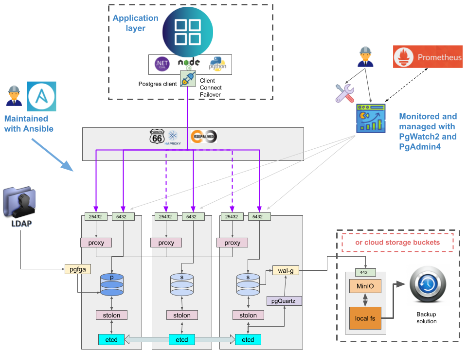

# pgVillage
Run a 100% Open Source awesome PostgreSQL solution

## Blueprint

For all details of this design, please refer to the [Blueprint design document](./design/Whitepaper%20PgVillage%20design%20blueprint.pdf).

## Roadmap
For roadmap we would like to refer you to [Github Issues](https://github.com/MannemSolutions/pgvillage/issues).

All issues linked to milestones are prioritized and planned.
All other issues will be prioritized and planned as we go.
Please bring us any feedback you can give us on prioritization and feature requests.
We will take all your feedback into account.
